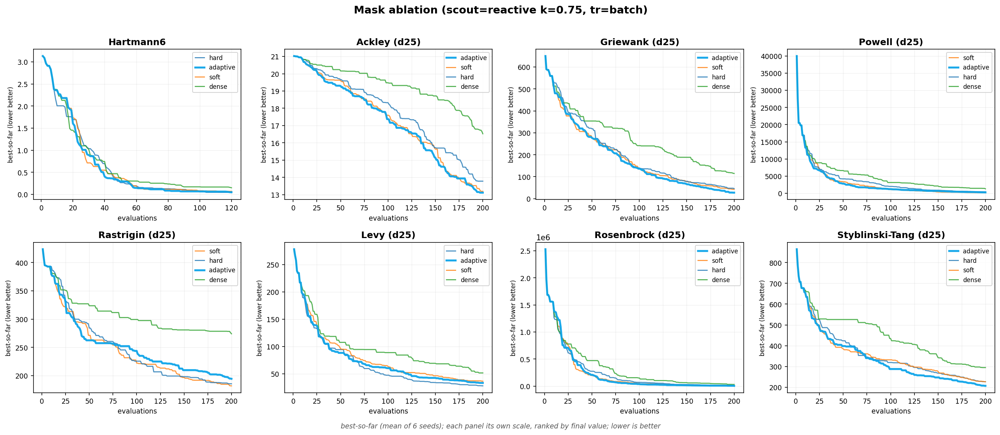

# S3-TuRBO: Adaptive Sparse Moves and Evidence-Gated Escape for Trust-Region Bayesian Optimization

A trust-region Thompson sampler for expensive, high-dimensional optimization with heterogeneous coordinates and many far-apart good basins. It extends single-region trust-region Bayesian optimization along two independent axes (how a local step perturbs coordinates, and how the search reaches distant basins) and computes almost every internal constant from the problem itself, so the optimizer does not become a second tuning problem.

The exposition is layered so that the prose, the displayed equations, and the algorithm blocks are each self-supporting: the text motivates and explains, the equations define the objects precisely, and the algorithm blocks give the executable procedure. All three share the notation fixed in §0, so they can be read together or separately.

---

## 0. Notation

| symbol | meaning |
|---|---|
| $f:[0,1]^d\to\mathbb R$ | objective; minimize; $f^\star=\min f$ |
| $d,\ q,\ B$ | dimension, batch size, total evaluation budget |
| $x_0$ | optional prior point (incumbent seed); may be absent |
| $\mathcal D_t=\{(u_i,y_i)\}_{i\le n_t}$ | observations after $t$ asks; $y_i=f(u_i)$ |
| $R=(c,\ell,v,\hat y,\hat u,\kappa)$ | a **region**: center $c\in[0,1]^d$, box side $\ell$, visit count $v$, best value $\hat y$, best point $\hat u$, kind $\kappa\in\{\textsf{main},\textsf{cand}\}$ |
| $\mathcal R_t$ | the region set; exactly one region has kind $\textsf{main}$ |
| $\mathrm{Box}(R)=\prod_{j}[\,c_j-\ell/2,\ c_j+\ell/2\,]\cap[0,1]^d$ | the trust region of $R$ |
| $\alpha\in[0,1]^d$ | per-coordinate **move weights** (the local-move axis) |
| $M_m(\rho)$ | **mask law**: a distribution on $[0,1]^d$ for move $m$ at density $\rho$ |
| $\rho=1/\sqrt d$ | active-coordinate fraction (derived; §3.2) |
| $g\sim\Pi(\,\cdot\mid S)$ | a posterior function sample from a GP fit on data $S$ |
| $\Sigma$ | **scout strategy** (the escape axis): a policy on the state |
| $S_y$ | robust scale of observed values (§5.3) |
| $\beta,\eta$ | region-importance weights; $\delta$ novelty radius; $c_0$ Beta concentration |

Prior information is $(d,q,B,x_0)$; posterior information is $(\mathcal D_t,\mathcal R_t)$. A quantity is **derived** if it is a function of these, and a **choice** otherwise (§5.5).

---

## 1. The problem

Minimize an expensive black box in twenty to thirty dimensions. A decent prior configuration is usually known but is not the global optimum. The objective is locally smooth, so a local model is faithful. The coordinates are not interchangeable, and moving all of them at once at one scale tends to wreck a good configuration. Finally, the good configurations form many separated islands, and occasionally one distant island hides a much better narrow core that is only found by committing budget to it. Formally, solve

$$
\min_{x\in[0,1]^d} f(x),\qquad d\in\{20,\dots,30\},
$$

from a batch-sequential oracle returning $f$ at $q$ points per round within a budget of $B$ evaluations, under four assumptions:

- **(A1) local smoothness.** $f$ is Lipschitz on each basin, so a GP posterior is faithful locally.
- **(A2) prior point.** an $x_0$ with $f(x_0)\ll\mathbb E_{x\sim\mathcal U}f(x)$ but $x_0\notin\arg\min f$ (may be absent).
- **(A3) heterogeneity.** the active subspace of local improvement has effective dimension $d_{\mathrm{eff}}\ll d$.
- **(A4) multi-basin.** $\{x:f(x)\le f^\star+\epsilon\}=\bigcup_k B_k$ with $\operatorname{dist}(B_i,B_j)\gg r_{\text{local}}$, and some $B_k$ contain a sub-basin of much lower value and much smaller radius.

These assumptions pull against each other. (A1)–(A2) demand hard local exploitation near $x_0$; (A4) demands a nonzero probability of leaving the current basin; (A3) demands that a local step move only a few coordinates. They are three separate requirements, met by three separate mechanisms: a local surrogate (§2), a scout (§3.3), and a coordinate mask (§3.1).

---

## 2. Base method and its structural limit

The base is trust-region Bayesian optimization, following TuRBO (Eriksson et al., 2019). Keep a box around the best point, fit a Gaussian-process surrogate inside it, propose the next points from that surrogate, and resize the box from feedback: grow it after a run of improvements, shrink it after a run of failures. The surrogate proposes points through a **Thompson-sampling acquisition**, which is TuRBO's default choice for batch selection and the acquisition we use throughout.

It is worth being precise about how Thompson sampling is applied, because the version used here is the discretized, batch form rather than the textbook one-point rule. At each ask we do not optimize a posterior sample continuously. Instead we lay down a finite candidate pool inside the box (a quasirandom Sobol set), draw $q$ independent function realizations from the GP posterior restricted to that pool, and take the pool-minimizer of each realization. The $q$ minimizers are the batch. In symbols, fixing the single region $R$ with center $c=\hat u$, the **candidate kernel** $\kappa_R$ is the law of a uniform draw in the box and the **Thompson acquisition** $\mathrm{TS}_q$ is:

$$
\kappa_R:\ X=c+r,\ \ r\sim\mathcal U\big(\mathrm{Box}(R)-c\big);\qquad
\mathrm{TS}_q(R;\mathcal D)=\Big\{\arg\min_{x\in P}g^{(k)}(x)\Big\}_{k=1}^{q},\ \ P\!\sim\!\kappa_R^{\otimes N},\ g^{(k)}\!\sim\!\Pi(\cdot\mid\mathcal D_R).
$$

The box adapts through a success counter $s$ and a failure counter $\phi$:

$$
\ell\leftarrow\min(\ell_{\max},1.5\,\ell)\ \text{ if } s\ge\texttt{succ\_tol};\qquad
\ell\leftarrow\max(\ell_{\min},\ell/2)\ \text{ if } \phi\ge\texttt{fail\_tol}.
$$

Thompson sampling earns its place here for two reasons. First, it carries no acquisition trade-off constant. Expected improvement and upper-confidence-bound acquisitions both need a term or coefficient that trades exploration against exploitation, and in high dimension a global GP with such an acquisition tends to over-explore, which is the very failure that motivated TuRBO's local trust region. A Thompson sample instead selects a point in proportion to its posterior probability of being the minimizer, so the exploration-exploitation balance is inherited from the surrogate's own uncertainty rather than set by hand. Second, it gives batch diversity for free: because the $q$ realizations are drawn independently, their minimizers naturally spread across the plausible optima without any constant-liar or penalization heuristic to keep a batch from collapsing onto one point. A stronger acquisition such as log-expected-improvement could be swapped in, but it would reintroduce a constant to tune and the per-batch diversity heuristic that Thompson sampling avoids, so we keep Thompson sampling as the base. Everything the method adds on top must preserve this knob-free property.

The limitation of the base is structural, not statistical. Once the box collapses onto one basin, a strictly better basin outside the box has probability of exactly zero of ever being sampled:

> **Proposition 1 (collapse).** If $\mathrm{Box}(R)\subseteq B_i$ and $\operatorname{dist}(B_i,B_j)>\ell/2$ for a better basin $B_j$, then under the base method $\Pr[X\in B_j]=0$ for the next proposal $X$.
>
> *Proof.* $X\in\mathrm{Box}(R)$ almost surely, so $\lVert X-c\rVert_\infty\le\ell/2$. For any $z\in B_j$, $\lVert z-c\rVert\ge\operatorname{dist}(B_i,B_j)>\ell/2\ge\lVert X-c\rVert$, hence $X\neq z$ and $X\notin B_j$ a.s. $\square$

So far-basin discovery is impossible without an external channel, which is exactly what the scout axis supplies. A second, independent weakness is that the base kernel perturbs every coordinate at one shared width, which is the wrong step under heterogeneity (A3), and this is what the mask axis repairs.

> **Algorithm 1: base ask/tell.**
> ```
> ask(R, q):
>   P ← N draws of  c + U(Box(R) − c)                 # candidate pool ~ κ_R
>   G ← GP fit on region-local data D_R
>   return [ argmin_{x∈P} g(x)  for g in q posterior draws of G ]   # TS_q
>
> tell(R, y_batch):
>   if best improved: s += 1; φ = 0   else: φ += 1; s = 0
>   if s ≥ succ_tol: ℓ ← min(ℓ_max, 1.5ℓ); s = 0
>   if φ ≥ fail_tol: ℓ ← max(ℓ_min, ℓ/2); φ = 0
> ```

---

## 3. Two orthogonal axes

The method is the base plus two independent choices: the **local move** (which coordinates a step perturbs) and the **scout** (how distant basins are reached). They are independent in the strict sense that any move composes with any scout, and they are two *separate* contributions that earn their keep in different regimes: the mask is what makes the method strong on unimodal and simple landscapes (it stands alone, with the scout off), while the scout is the addition for landscapes that are, or might be, genuinely multi-basin. A user who knows the problem is simple can take the mask and leave the scout; the escape axis is opt-in insurance for the multi-basin case (§7.6, §8).

### 3.1 The local move

A raw candidate $r$ sits somewhere in the box. Rather than use it wholesale, each coordinate of $r$ is mixed toward the region center $c$ by a weight $\alpha_j\in[0,1]$: weight one takes the box value, weight zero keeps the center, in between takes a partial step. A move is thus a law over the weight vector $\alpha$, replacing the base kernel $\kappa_R$ by the masked kernel

$$
\kappa_R^m:\quad X = c + \operatorname{diag}(\alpha)\,(r-c),\qquad r\sim\mathcal U(\mathrm{Box}(R)),\quad \alpha\sim M_m\big(\rho(v_R)\big).
$$

Three laws $M_m(\rho)$, each with expected active mass $\mathbb E\sum_j\alpha_j=\rho d$:

$$
\text{dense: }\alpha_j=1;\qquad
\text{hard: }\alpha_j\overset{\text{iid}}{\sim}\mathrm{Bernoulli}(\rho);\qquad
\text{soft: }\alpha=\tfrac{\rho d}{\sum_j m_j}m,\ \ m_j\overset{\text{iid}}{\sim}\mathrm{Beta}\big(\rho c_0,(1-\rho)c_0\big),\ c_0>0.
$$

Dense moves every coordinate (the base move). Hard moves a random subset fully and freezes the rest. Soft draws each weight from a *polarized* law: for small $c_0$ (and at the derived $\rho=1/\sqrt d$, the range used here) most mass sits near $0$ or $1$, so it keeps the "mostly frozen" character of sparsity, yet it stays continuous, so it can also take a small coordinated step and its effective dimension varies smoothly with $\rho$. Because the three laws are one family, dense and hard are limiting cases of soft:

> **Proposition 2 (soft contains dense and hard).** As $c_0\to0^{+}$ with mean $\rho$ fixed, $M_{\text{soft}}(\rho)\Rightarrow M_{\text{hard}}(\rho)$; and $M_{\text{soft}}(1)=M_{\text{dense}}$ a.s.
>
> *Proof.* With mean fixed at $\rho$ and $c_0\to0^{+}$, the density $\propto x^{\rho c_0-1}(1-x)^{(1-\rho)c_0-1}$ diverges at both ends, concentrating mass on $\{0,1\}$ with $\Pr[m_j=1]\to\rho$, i.e. $\mathrm{Bernoulli}(\rho)$; the renormalizer $\to\rho d/(\rho d)=1$. At $\rho=1$ both Beta parameters force $m_j=1$. $\square$

Whether sparsity helps depends on the space, which is why the move is an explicit choice rather than a default:

> **Proposition 3 (sparsity is conditional).** Let $f$ have active set $A$ of size $d_{\mathrm{eff}}$ (coordinates outside $A$ do not change $f$). A $\rho$-sparse step leaves every irrelevant coordinate unmoved with probability $(1-\rho)^{d-d_{\mathrm{eff}}}$, versus $0$ for a dense step. Hence when $d_{\mathrm{eff}}\ll d$ (A3) a sparse step is far more likely to be supported on $A$, while at $d_{\mathrm{eff}}=d$ freezing any coordinate only removes a usable direction.
>
> *Proof sketch.* Improvement requires a favorable move within $A$; perturbing coordinates outside $A$ adds variance to the surrogate's credit assignment without changing $f$. Sparse masking raises the probability of a clean step supported on $A$ precisely when $A$ is small, and is pure loss of freedom when $A$ is everything. $\square$

The move is a pure function of $\rho$ and $d$, so new laws (top-$k$, learned masks) drop in without touching the rest of the method.

> **Algorithm 2: masked local candidate.** The mask primitive takes the density $\rho$ and (for soft) the
> concentration $c_0$; both come from the region and the run, so the same primitive serves the fixed and
> adaptive masks (§3.2, §3.2a).
> ```
> mask(m, ρ, c0, d) → α ∈ [0,1]^d:
>   dense: α = 1                                        # ρ, c0 ignored
>   hard : α = Bernoulli(ρ) per coord   (force ≥1 active)
>   soft : w = Beta(ρ·c0, (1−ρ)·c0) per coord;  α = clip(w · ρd/Σw, 0, 1)
>
> local_candidate(R, m, s):                             # s = mask credit (§3.2a), unused if fixed
>   ρ  = 1/sqrt(d)                                     # §3.2 derived active fraction
>   c0 = (m == adaptive) ? shape_c0(s) : c0_fixed        # §3.2a
>   r  = U(Box(R));   α = mask(m, ρ, c0, d)
>   x = c_R + α ⊙ (r − c_R); return x, |x − c_R|          # candidate and its realized displacement
> ```

### 3.2 The active fraction

How many coordinates should a move perturb? Under the standard assumption that the active set of a hyperparameter landscape grows sublinearly, of order $\sqrt d$ (assumption A3 made quantitative), the expected number of moved coordinates should match that size. Since a mask moves $\rho d$ coordinates in expectation, setting $\rho d=\sqrt d$ gives

$$
\rho=\frac{1}{\sqrt d}.
$$

This is a single derived value with no free parameter: enough freedom to improve, few enough to keep a step supported on the active set (Proposition 3). There is no visit-count schedule and no clamp. An ablation (§7.2) confirms the annealed, clamped form used by the prototype is no better, and slightly worse, than this flat $1/\sqrt d$; the "explore many coordinates early, few late" behavior a schedule tried to impose is instead supplied by the concentration, which the adaptive mask learns online (§3.2a) rather than annealing on a clock.

### 3.2a Learning the mask concentration from the run

The soft law has two shape parameters: the active fraction $\rho$ (how many coordinates a move perturbs) and the concentration $c_0$ (how polarized between frozen and fully moved). Section 3.2 fixes $\rho=1/\sqrt d$ from the active-set assumption; nothing yet supplies $c_0$ beyond a constant. The adaptive mask leaves $\rho$ at its derived value and learns $c_0$ from the run's record of which coordinates have paid off. The asymmetry is deliberate and is confirmed by ablation (§7.2 context): $\rho$ already has a principled prior value, and deriving $\rho$ online from the credit is *worse* than $1/\sqrt d$; but $c_0$ has no such prior, so learning it helps.

Each coordinate carries a **credit** $s_j$, an exponential-memory estimate of the improvement attributable to moving it. When a batch is observed, every improving point casts its normalized improvement, distributed over coordinates by its *squared realized displacement* from the region center. This is the correct attribution signal: the mask weight $\alpha$ is coordinate-symmetric for the soft law, so crediting by $\alpha$ carries no per-coordinate information, whereas how far a coordinate actually moved when the improvement occurred does. Writing $\delta_{ij}=|u_{ij}-c_j|$ and $y_\star$ for the incumbent before the batch,

$$
\Delta_i=\frac{\max(0,\ y_\star-y_i)}{S_y},\qquad
s_j\leftarrow\lambda\,s_j+\sum_i \Delta_i\,\frac{\delta_{ij}^2}{\sum_k \delta_{ik}^2},
$$

with $\lambda$ the credit memory and $S_y$ the robust value scale (§5.3), which makes $\Delta_i$ scale-free so $\lambda$ transfers across tasks. The concentration then reads the sharpness of the credit and sets $c_0$:

$$
p_j=\frac{s_j}{\sum_k s_k},\qquad
C=1-\frac{H(p)}{\log d},\quad H(p)=-\sum_j p_j\log p_j,\qquad
c_{0,t}=\exp\!\big((1-C)\log c_{\max}+C\log c_{\min}\big),
$$

with $C\in[0,1]$ a **confidence** that rises from $0$ (credit spread evenly: nothing learned) toward $1$ (credit concentrated: a clear active set) and $[c_{\min},c_{\max}]$ the concentration range. With no evidence ($C\to0$) the mask stays soft and wide ($c_{\max}$), continuing to probe which coordinates matter; once credit concentrates ($C\to1$) it sharpens toward a hard, polarized mask ($c_{\min}$) that commits to the coordinates carrying the signal. By Proposition 2 the soft law contains dense and hard as limits, so this is a continuous walk along that family in the direction the data points. Before any credit has accrued the update is a no-op and the mask is exactly the fixed soft mask, so the adaptive path never degrades the fixed one at the start of a run.

> **Proposition 3a (the credit signal concentrates on the active set).** Suppose $f$ has active set $A$ of size $d_{\mathrm{eff}}$, and that a positive fraction of improving moves are supported on $A$. Then the credit mass on $A$ grows relative to its complement, so $p$ concentrates on $A$ and $C\to1$; the concentration $c_{0,t}\to c_{\min}$, giving a polarized mask that commits to $A$, without $A$ or the regime being supplied.
>
> *Proof sketch.* Coordinates outside $A$ do not change $f$, so an improving move that displaces them does so incidentally; their expected squared-displacement share of the credit is bounded and decays under $\lambda$, while coordinates in $A$ that had to move for the improvement take the dominant share every time an $A$-supported improving move lands. The ratio of in-$A$ to out-of-$A$ credit therefore grows, so $p$ concentrates on $A$ and $C\to1$; the continuous concentration map gives $c_{0,t}\to c_{\min}$. $\square$

Only the concentration is learned; nothing downstream changes, and $\rho$ remains at its derived $1/\sqrt d$. Its constants (the memory $\lambda$, the range $[c_{\min},c_{\max}]$) are choices with validated defaults. The credit signal, currently incumbent-improvement attributed by displacement, is the natural place to strengthen the method next (§9): rank-weighted batch credit, GP-lengthscale priors, per-region credit.

> **Algorithm 2a: adaptive soft mask (concentration only).**
> ```
> tell(batch U, values y, prev best y*):        # accrue coordinate credit
>   s ← λ · s
>   for each improving non-scout point i:
>     Δ  ← (y* − y_i) / S_y                       # normalized improvement (>0)
>     δ² ← (u_i − center)²                         # realized squared displacement
>     s  ← s + Δ · δ² / Σ δ²                       # attribute by where it actually moved
>
> mask_shape:                                     # called when a soft mask is drawn
>   ρ_t ← 1/sqrt(d)                                # derived active fraction, NOT learned
>   if Σ s ≈ 0:  c0_t ← c0_default; return (ρ_t, c0_t)
>   p ← s / Σ s;   C ← clip(1 − H(p)/log d, 0, 1)
>   c0_t ← exp((1−C)·log c_max + C·log c_min)
>   return (ρ_t, c0_t)
> ```

### 3.3 The scout

The scout is the escape channel Proposition 1 makes mandatory. In practice a scout proposal rarely produces the incumbent improvement itself, since local steps do that, so its role is coverage insurance: keep the probability of reaching a distant useful basin above zero at low cost to local exploitation. A scout strategy is a triple $\Sigma=(\pi,\mathrm{prom},\mathrm{alloc})$ of a **tick** (fire a scout this ask?), a **promotion** rule (turn an observation into a candidate region?), and an **allocation** (split the $q$ slots across regions and moves):

$$
\pi(\mathcal R_t,t)=[\,t\equiv0\ (\mathrm{mod}\ p)\,]\ \lor\ [\,\text{no improvement}\ge\texttt{stag}\,],
$$

$$
\mathrm{prom}(u,y,\mathcal R)=\Big[\min_{R}\tfrac{\lVert u-c_R\rVert}{\sqrt d}\ge\delta\Big]\ \wedge\ \Big[\,y\le Q_a(\mathbf y)\ \lor\ y\le\min\mathbf y+a_\Sigma\,S_y\,\Big],
$$

where $Q_a$ is a promotion quantile and $a_\Sigma$ is a per-strategy acceptance margin ($2$ for `random`, $1$ for the sidecar family), distinct from the risk coefficient $c$ that sets the *focus* gate (§3.5). The five strategies are a single design progression: each adds one mechanism to fix the previous one's failure. They differ *only* in the three functions above, not in switches bolted onto a shared core.

| $\Sigma$ | tick $\pi$ | mines log | allocation when scouting | focus burst |
|---|---|---|---|---|
| **none** | never | – | $q$ local on the one region | – |
| **random** | periodic | yes | $q{-}1$ local (round-robin over $\mathcal R$) $+1$ far probe | – |
| **sidecar** | periodic $\lor$ stagnation | no | $q{-}s$ local on a *protected* main $+ s$ into candidate regions | – |
| **switch** | as sidecar | no | as sidecar, unless a focus episode is active | $q{-}1$ dense-in-candidate $+1$ main, bounded window |
| **reactive** | evidence-scaled | mines best | as switch | as switch, but *armed and sized by accumulated evidence* |

Read the table top to bottom as the argument.

**none → the escape floor.** With no scout, Proposition 1 makes distant basins unreachable. Any positive scout rate fixes this:

> **Proposition 4 (escape floor).** Let $\mu_t$ be the probability a scout slot at ask $t$ lands in $\bigcup_k B_k$, and $\rho_t$ the fraction of ask-$t$ slots that are scout slots. Then $\Pr[\text{some scout reaches a useful basin by ask }T]\ \ge\ 1-\prod_{t=1}^{T}(1-\rho_t\mu_t)$.
> For $\Sigma=\textsf{none}$, $\rho_t\equiv0$ and the bound is $0$, consistent with Proposition 1. For any strategy with $\rho_t>0$ the floor is strictly positive and tends to $1$ as $T\to\infty$ whenever $\inf_t\mu_t>0$.
>
> *Proof.* The complementary event "no scout ever lands" factorizes across ticks with per-ask non-landing probability at most $1-\rho_t\mu_t$; take the product and complement. $\square$

**random → the naive floor.** The simplest way to make $\rho_t>0$: fire one far probe on a fixed period $p$, placed at the pool point farthest from all data, $u^\star=\arg\max_{u\in P_{\text{far}}}\min_i\lVert u-u_i\rVert$, and mine the log for any observed point that passes the promotion gate. This is barely more than restarting a fresh local search elsewhere (it has no memory of whether escape is paying off), so it only occasionally helps and can waste budget on a single-basin problem. It is kept as the honest weak baseline.

**random → sidecar: protect the incumbent.** A far probe stolen from the main region's batch slows local exploitation. Sidecar instead keeps the main region's $q{-}s$ slots *protected* and spends only $s$ extra slots on the escape channel, which it routes into promoted **candidate regions** (§3.4) rather than one-shot probes. The escape now has somewhere to accumulate, but a candidate region only takes light local steps; it never gets enough concentrated budget to actually descend a far basin.

**sidecar → switch: commit with a burst.** Descending a found basin needs sustained effort, not scattered probes. Switch adds a **focus burst**: when a candidate passes the focus gate, it opens an episode that spends $q{-}1$ slots *dense-in-that-candidate* for a bounded window, driving its trust region down into the basin while one slot protects the main path. This is what makes escape actually reach a core (§7.3). Its flaw is that the burst fires on *every* qualifying candidate, including ones a smooth landscape throws up, so it spends escape budget where there is nothing to escape and drags every general task.

**switch → reactive: spend in proportion to evidence.** The final step makes the escape *adaptive*. It cannot be predictive: no statistic of a local search's data reveals whether a far basin exists, because the surrogate has never sampled there (§9). So reactive does not predict; it *reacts* to the outcome of candidates it has already planted. It keeps a small always-on base scout rate (a hedge: far basins can never be cheaply ruled out) and tracks a scalar **escape value** $E\in[0,1]$:

$$
E\ \leftarrow\ (1-\gamma)\,E\ +\ \gamma\cdot\mathbb{1}\!\left[\,\underbrace{\tfrac{\lVert c_R-c_{\text{main}}\rVert}{\sqrt d}\ge\delta}_{\text{spatially distinct}}\ \wedge\ \underbrace{\hat y_R\le \hat y_{\text{main}}+3\,S_y}_{\text{competitive}}\,\right]\quad\text{per worked candidate }R,
$$

where $\delta$ is the *same novelty radius* used everywhere else (§5.4) and $3S_y$ is a robust "not much worse" band, so there is no new threshold. Each recently-worked candidate that is **distinct and competitive** pushes $E$ up; one that has drifted back to the incumbent's basin, or come back worse, pushes it down. The memory $\gamma=1-1/\max(2,N_{\max})$, where $N_{\max}$ is the region cap `max_regions` (§5.2), keeps the value's effective window at about one region-population's worth of history. The scout rate and the burst then scale with $E$:

$$
\Pr[\text{scout this ask}] = \rho_0 + (1-\rho_0)\,E,\qquad \text{arm a focus burst only while } E>\tfrac{\rho_0}{2}.
$$

The arm gate $\rho_0/2$ sits just below the always-on rate, so a single below-base blip cannot commit the expensive burst; a burst is armed only once several recent candidates have registered as distinct and competitive. Reactive therefore does not predict the unseen and does not try to classify the landscape from local data (which cannot reveal a far basin, §9): it always spends the derived base rate $\rho_0$ set by the dial $k$, and lets the measured outcome of candidates it has already planted modulate that spend up or down. The base rate is the load-bearing quantity (a principled, $k$-controlled *dose* of speculative escape), and the evidence term is a bounded reallocation on top of it.

**The base rate is the one escape dial.** $\rho_0$ is not a free constant; it is derived from the same $\sqrt d$ prior as the mask, through a single knob $k$:

$$
\rho_0 = \frac{1}{k\sqrt d}.
$$

The mask's active fraction is $1/\sqrt d$ (§3.2); the escape axis speculatively explores at $1/k$ of that rate. Large $k$ scouts little, so reactive collapses toward `none`, the right behavior on a near-unimodal landscape; small $k$ scouts aggressively, so reactive approaches `switch`, the right behavior on a multi-basin one. So $k$ is a *single continuous dial* that spans the entire discrete escape axis, and the user sets it by one prior belief: how multi-basin the problem is likely to be. It is the **only** tunable number in the method; every other constant is derived (§5).

The dial is not monotone in quality: too large wastes the escape channel, too small over-spends it, and the useful band is $k\in[0.5,1]$ (§7.3 traces the full curve). The default is $k=0.75$. Read against the methods it actually competes with, this is the all-round sweet spot: reactive at $k=0.75$ ranks **first** on the real HPO suite (ahead of pure-local `none` and every external baseline), is **second only to `none`** on the smooth synthetic suite, and still reaches a deep core on $90\%$ of medium many-basin runs where `none` reaches none. A larger $k\approx1$ buys a little more on the smooth suite at the cost of real-HPO rank; a smaller $k\approx0.5$ buys stronger many-basin escape at the cost of the smooth suite. Because reactive with the default $k$ is the recommended escape, $k$ is typically the only choice a user makes, and only when a strong prior about the landscape justifies moving off $0.75$.

> **Algorithm 3: scout ask/tell (unified over $\Sigma$).**
> ```
> scout_ask(Σ, R_set, q):
>   if Σ ∈ {switch, reactive} and focus_active:              # asymmetric burst
>     return (q−1)×[dense-local in focus_cand] + 1×[local in protected main]
>   p_scout = scout_rate(Σ)                                  # none: 0;  random/sidecar/switch: tick ∈ {0,1}
>                                                            # reactive: ρ0 + (1−ρ0)·E
>   n_scout ~ (1 slot with prob p_scout, capped at q−1)      # at most one scout slot per ask
>   if n_scout = 0:
>     if Σ ∈ {none, random}:  return round_robin_local(ranked(R_set), q)   # local over all regions
>     else:                   return q×[local in protected main]           # sidecar family
>   if Σ = random:  return (q−n_scout)×[round_robin_local] + n_scout×[far probe]
>   return (q−n_scout)×[local in protected main] + n_scout×[candidate w.p. p_c else far probe]
>
> scout_tell(Σ, batch, y):
>   for scouted (u,y):  if prom(u,y): add_candidate(u)       # novelty ∧ value gate  (§3.3 prom)
>   if Σ = random:      mine_log_for_candidates()
>   if Σ ∈ {switch, reactive}:                               # switch-family focus management
>     if a promoted candidate passes the focus gate:  arm a focus episode on it
>     if no focus active and want_scout:  mine one archive point past the focus gate, arm on it
>     if focus active and the incumbent improved:     extend the episode (focus_left ← max(·, W/2))
>   if Σ = reactive:                                         # update escape value E from outcomes
>     for each worked candidate R:
>       distinct    = dist(center_R, center_main)/√d ≥ δ
>       competitive = best_y_R ≤ best_y_main + 3·S_y
>       E ← (1−γ)·E + γ·[distinct ∧ competitive]
>     if E > ρ0/2 and no focus active:                       # evidence-triggered re-arm
>       arm a focus episode on the best candidate if it passes the focus gate and its box is not collapsed
>   while |R_set| > max_regions:  drop worst non-main, non-warming region by I(R)   # §3.4
> ```

The one non-derived constant of reactive is the base rate $\rho_0$ (how much to speculatively hedge before evidence); everything else (the distinctness radius $\delta$, the competitiveness scale $S_y$, the region budget) is derived or already fixed. Deriving $\rho_0$ from an explore-vs-exploit cost argument is left open (§9).

### 3.4 Candidate regions and importance

The multi-region strategies keep one main region on the incumbent and a few candidates. A candidate is created only if it is genuinely far from existing regions and passes the value gate; it first takes a few cheap probes, then fits its GP on *only its own local data*, so it explores its own basin instead of inheriting the incumbent's. This region-local training is the single most important implementation detail. When there are too many regions, the least valuable is dropped, but youth and distance are rewarded so a promising far region is not starved:

$$
\mathcal I(R)=\hat y_R-\beta\,S_y\sqrt{\tfrac{\log(n_t+2)}{v_R+1}}-\eta\,S_y\,\nu(R),\qquad
\nu(R)=\min_{R'\neq R}\tfrac{\lVert c_R-c_{R'}\rVert}{\sqrt d}.
$$

Lower $\mathcal I$ is kept; the worst non-main, non-warming region is dropped. The $\sqrt{\log(n_t+2)/(v_R+1)}$ term is the UCB1 exploration bonus from bandit theory, so its coefficient is the standard $\beta=1$; the coverage weight is likewise $\eta=1$. Multiplying both by the robust value scale $S_y$ (§5.3) makes them pure numbers rather than task-dependent thresholds. An ablation confirms the pruning order is insensitive to these weights (varying them over an order of magnitude changes nothing), so no tuning is warranted and the unit UCB1 value is used.

### 3.5 Why the scout must be conditional and asymmetric

On a deliberately hard structure (many look-alike basins, a few hiding narrow cores, a start planted off-core), three exploration designs separate cleanly. Serving all basins equally achieves the best coverage but the worst final value and never reaches a core: it over-explores and under-polishes. The sidecar strategy protects the local path and ties the strong baselines, but it still misses cores, because a strictly bounded side channel never concentrates enough budget on any one candidate. The switch strategy is the first to reach a core, because it *concentrates* $q-1$ slots on one candidate for a bounded window while keeping one protected main slot. The quantitative reason is a volume argument:

> Reaching a narrow core of radius $r_c\ll\ell$ from outside requires $\Omega\big((\ell/r_c)^{d_{\mathrm{eff}}}\big)$ concentrated local samples (the shrinking-box volume ratio). A per-batch budget of $s$ slots supplies $O(sT)$ total but only $O(s)$ *consecutive* samples on any one candidate, which is insufficient unless $s$ is temporarily raised. The switch burst raises it to $q-1$ for $\Theta(f_{\text{focus}}B/q)$ consecutive asks, which is the minimal change that makes the required concentration attainable while one main slot is protected.

The principle: exploration cheap and conditional; intensification temporary, bounded, and evidence-gated. An always-on burst would be the "serve every basin" failure again, so the switch is a conditional choice, appropriate when a far basin plausibly hides a better core, and not otherwise.

---

## 4. The method as one operator

The whole method is one ask/tell loop over a state that carries the data, the regions, the mask credit, and the counters. Writing the state as $z_t=(\mathcal D_t,\mathcal R_t,s_t,\theta_t)$, with $\mathcal D_t$ the observations, $\mathcal R_t$ the region set (§3.4), $s_t\in\mathbb R^d$ the coordinate-credit vector (§3.2a), and $\theta_t$ the box and scout counters, one step is the map $\Phi_\Sigma^m$ below.

**Ask.** The scout allocates the $q$ slots across regions and move types (§3.3). Each local slot draws from the masked Thompson kernel of its region: for region $R$ with mask $m'$, the mask shape is set from the derived $\rho$ and, when adaptive, the credit,

$$
\rho=1/\sqrt d\ \ (\text{§3.2}),\qquad
c_{0,R}=\Gamma(s_t)\ \ (\text{§3.2a, adaptive; else fixed}),
$$

and the slot is one discretized Thompson draw $\mathrm{TS}_1(R;\mathcal D_{R,t})$ under $\kappa^{m'}_R$ evaluated with $(\rho_R,c_{0,R})$. Scout slots are far probes. Collecting the slots,

$$
A_t=\bigsqcup_{(R,m')\in\mathrm{alloc}(\mathcal R_t,q,\pi)}\!\!\mathrm{TS}_1\!\big(R;\mathcal D_{R,t}\big)\ \text{under }\kappa^{m'}_R,\qquad Y_t=f(A_t).
$$

**Tell.** The batch appends to the data, updates each touched region's box, accrues mask credit from the improving points, and runs the strategy's region bookkeeping:

$$
\mathcal D_{t+1}=\mathcal D_t\cup(A_t,Y_t),\qquad
s_{t+1}=\lambda\,s_t+\!\!\sum_{i\ \text{local}}\!\Delta_i\,\hat\delta_i^2,\qquad
\mathcal R_{t+1}=\big(\mathrm{prune}\circ\mathrm{focus}\circ\mathrm{mine}\circ\mathrm{promote}\circ\mathrm{adapt}\big)(\mathcal R_t,A_t,Y_t),
$$

where $\Delta_i=\max(0,y_\star-y_i)/S_y$, $\hat\delta_i^2$ is the point's displacement share $\delta_i^2/\sum_k\delta_{ik}^2$ (§3.2a), $\mathrm{adapt}$ applies the box dynamics of §2 per region, $\mathrm{promote}/\mathrm{mine}/\mathrm{focus}$ are the strategy functions of §3.3, and $\mathrm{prune}$ drops by $\mathcal I$ (§3.4). The method iterates $z_{t+1}=\Phi_\Sigma^m(z_t)$ from $z_0=(\{(x_0,f(x_0))\},\{R_{\textsf{main}}\},\mathbf 0,\theta_0)$ until $|\mathcal D|\ge B$, and returns $\arg\min_{\mathcal D}y$. Proposition 1 bounds what a single region can reach, Proposition 4 the escape floor the scout adds, and Proposition 3a the limit the credit drives $c_0$ to.

> **Algorithm 4: the full method.**
> ```
> input:  mask m ∈ {dense, soft, hard, adaptive}, scout Σ ∈ {none, random, sidecar, switch, reactive},
>         problem (d, q, B), optional x0, risk
> derive: n_init, pool N, max_data; (ρ_init, ρ_min, τ); (ℓ_init, ℓ_min, ℓ_max);
>         succ_tol, fail_tol; scout period p, stag; max_regions; novelty δ; focus window     # §5
> init:   R_main ← region(x0 or none, ℓ_init);  s ← 0 ∈ ℝ^d;  if x0: observe(x0)
>
> while |D| < B:
>   S_y ← robust_scale(y)                                          # §5.3
>   if |D| < n_init:  ask quasirandom warmup; tell; continue
>
>   # ask: scout allocates slots; each local slot is a masked Thompson draw
>   for each local slot in a region R with move m':                # §3.3 alloc
>     ρ_R  ← 1/sqrt(d)                                            # §3.2 derived (always)
>     c0_R ← (m == adaptive) ? shape_c0(s) : c0_fixed              # §3.2a  (credit → concentration)
>     x    ← argmin over pool of one posterior draw, under κ^{m'}_R with (ρ_R, c0_R)   # §2 TS_1
>   scout slots  ← far probes
>   batch, roles ← the assembled slots
>
>   y ← f(batch);  D ← D ∪ (batch, y)
>
>   # tell: boxes, mask credit, region bookkeeping
>   update trust-region success/failure counters per touched region                    # §2
>   if m == adaptive:  s ← λ·s + Σ_{improving local i} (Δ_i · δ_i² / Σ δ_i²)            # §3.2a
>   scout_tell(Σ, batch, y, roles)          # promote ∘ mine ∘ focus ∘ prune            # §3.3, §3.4
>
> return argmin over D
>
> shape_c0(s):                                                     # §3.2a
>   if Σ s ≈ 0:  return c0_default
>   p ← s / Σ s;   C ← clip(1 − H(p)/log d, 0, 1)
>   return exp((1−C)·log c_max + C·log c_min)
> ```

The following quantities enter the operator; the last column says whether each is computed or chosen.

| quantity | value / rule | origin |
|---|---|---|
| $\rho=1/\sqrt d$ | §3.2, §5.1 | derived ($d$; active-set assumption) |
| $\texttt{succ\_tol},\texttt{fail\_tol}$ | §5.1 | TuRBO constant / derived ($d_{\mathrm{eff}},q$) |
| $\ell_{\text{init}},\ell_{\min},\ell_{\max}$ | §5.2 | derived (cube geometry, resolution) |
| $\texttt{n\_init},\texttt{max\_regions}$ | §5.2 | derived ($q$; budget-proportional) |
| $N,\texttt{max\_data}$ | §5.2 | compute controls (not optimizer knobs) |
| $\delta$ | §5.4 | derived (cube geometry) |
| $S_y$ | §5.3 | posterior ($\mathbf y$) |
| $s_t,\ C,\ c_{0,t}$ (adaptive mask) | §3.2a | posterior ($\mathcal D_t$, credit) |
| $\lambda,c_{\min},c_{\max}$ | fixed | algorithm constants |
| $Q_a,a_\Sigma,c,\beta,\eta$, scout slots, focus fractions | §5.5 | strategy defaults / choice ($\Sigma$, risk) |
| $m,\Sigma$ | the two axes | choice (declarations about the space) |

---

## 5. Where the constants come from

Each rule below is derived from prior or posterior information and comes with the reason it is the right rule. The governing principle: compute from $(d,q,B,x_0)$ or from the data; expose as a knob only a genuine choice (§5.5).

### 5.1 Effective dimension → sparsity and box patience

The active fraction is $\rho=1/\sqrt d$ (§3.2), so a masked region moves $d_{\mathrm{eff}}=\rho d=\sqrt d$ effective coordinates. The box-patience counters follow from that:

$$
d_{\mathrm{eff}}=\rho d=\sqrt d,\qquad
\texttt{succ\_tol}=3,\qquad
\texttt{fail\_tol}=\max\!\big(4,\ \lceil d_{\mathrm{eff}}/q\rceil\big).
$$

$\texttt{succ\_tol}=3$ is TuRBO's grow-after-three-successes constant, adopted as is. For $\texttt{fail\_tol}$: each batch probes $q$ of the region's $d_{\mathrm{eff}}$ effective directions, so declaring the box too large should take about one failed batch per effective direction, $\lceil d_{\mathrm{eff}}/q\rceil$ batches. The floor of $4$ is an interpretable guard, not a fit: a single Thompson batch fails to improve with non-negligible probability even inside a good box (the draws are stochastic), so shrinking on fewer than a few consecutive failures would react to sampling noise rather than a genuinely oversized box. Four is the smallest count at which the chance of four unlucky no-improvement batches in a row is small.

### 5.2 Warmup, trust-region bounds, sizes, cadences

$$
\texttt{n\_init}=2q,\qquad
\ell_{\text{init}}=\ell_{\max}=1,\qquad
\ell_{\min}=\delta/8,
$$

$$
\texttt{max\_regions}=1+\min\!\big(3,\max(1,\lfloor B/(20q)\rfloor)\big)\ \text{(and }1\text{ for the single-region scouts }\textsf{none},\textsf{random}),\qquad
\texttt{focus\_batches}=\lceil f_{\text{focus}}B/q\rceil.
$$

**Warmup.** $\texttt{n\_init}=2q$ is one batch-pair of quasirandom points, the minimum to fit a GP before the first Thompson draw. A larger floor is unnecessary (it never binds) and a $d{+}1$ rule, which one might expect from the $d$ lengthscales, is measurably worse: the GP's shared prior needs far fewer than $d{+}1$ points to give a useful posterior, and spending more of the budget on undirected warmup costs more than it buys.

**Trust-region bounds are geometric, not tuned.** The box side cannot exceed the cube side, so $\ell_{\max}=1$; there is no larger meaningful value. Starting at $\ell_{\text{init}}=\ell_{\max}=1$ begins the search global and lets the failure counter shrink it, so no initial size is chosen. The floor $\ell_{\min}$ is a resolution: below the side at which the box can no longer separate a novel candidate from the incumbent (the novelty radius $\delta$ of §5.4), further shrinking only refines noise, so $\ell_{\min}=\delta/8$, a few halvings below $\delta$. An ablation (§7.2 context) confirms these parameter-free bounds match the hand-picked prototype values and beat TuRBO's own published constants; the prototype's conditional lookup table for $\ell$ earned nothing.

**Region count and focus window.** A single-region scout keeps one region; a multi-region scout adds one candidate region per $\sim\!20$ asks, so the count scales with how much budget there is to explore alternatives, capped at a few so per-region GP fits and pruning stay cheap. The focus window $\texttt{focus\_batches}=\Theta(f_{\text{focus}}B/q)$ is exactly the consecutive-concentration length §3.5 shows is needed to reach a narrow core. The candidate pool $N$ and GP cap $\texttt{max\_data}$ are compute controls, not optimizer knobs: the argmin over the Sobol pool improves monotonically with $N$, and $\texttt{max\_data}$ only bounds the GP's $O(n^3)$ cost, so both are set to a comfortably large value and results are insensitive to the exact number.

### 5.3 Observed values → scale-free gates

$$
S_y=\max\!\big(\operatorname{IQR}(\mathbf y),\,1.4826\,\operatorname{MAD}(\mathbf y),\,\sigma_{\text{noise}},\,\epsilon\big).
$$

An absolute margin is meaningless across tasks whose scales differ by orders of magnitude. The factor $1.4826\,\mathrm{MAD}$ is the consistent Gaussian $\sigma$-estimator; IQR guards multimodal spreads; the outer max is conservative on heavy tails. Dividing every gate and the importance weights $\beta,\eta$ by $S_y$ turns them into pure numbers that transfer across tasks.

### 5.4 Cube geometry → novelty radius

$$
\delta\approx0.6\sqrt{1/6}\approx0.245.
$$

Two uniform points in $[0,1]^d$ have per-coordinate RMS distance $\sqrt{1/6}\approx0.408$, independent of $d$. Requiring a candidate to be at least $60\%$ of that typical distance from every region makes "novel" mean *materially separated*, not merely numerically distinct, so promotion creates genuinely different basins and the coverage term $\nu$ (§3.4) is on the same scale.

### 5.5 What stays a choice

Only what no prior or posterior can decide. There are three such discrete choices, all regime declarations
about the landscape. The first is the move $m$: Proposition 3 shows the right move genuinely depends on
whether the space is isotropic or heterogeneous, which only the user knows. The second is the scout
$\Sigma$, which sets how much escape is warranted and how far to trust distant basins, and Proposition 1
versus §3.5 shows this is regime-dependent. The third is the trust-region update granularity
$\in\{\text{batch}, \text{point}\}$: per-batch success/failure counting (standard TuRBO) shrinks the box
slowly, which wins multimodal and basin-structured landscapes, while per-point counting shrinks it up to
$q$ times faster, which wins smooth convex valleys where aggressive convergence down one funnel is the
goal. Neither dominates (the ablation is regime-split, like the mask), so it is a knob, not a derived
constant, and the default is batch (the standard TuRBO semantics, and the safe choice for the many-basin
target regime). A strategy's own behavioral constants, namely its promotion quantile $Q_a$, focus
quantile, candidate-versus-probe probability, and slot count $s$, belong to the strategy, with validated
defaults, not to the optimizer. The remaining surface is `budget` (which sharpens §5.2) and
`risk`, a single word setting the margin coefficient $c$ (conservative $0.10$, balanced $0.25$, aggressive
$0.40$), plus an optional explicit value or noise scale. In practice the mask self-selects (§3.2a), so the
scout is the one axis a user usually sets (§8).

---

## 6. Components introduced here

The method reuses validated mechanisms but adds six small pieces not present verbatim in the prototypes, flagged so the reader knows what is new. First, treating dense and hard as the $c_0\to0$ and $\rho=1$ limits of one Beta law (Proposition 2) is a consolidation, not a new behavior, since it is numerically identical at the endpoints. Second, the scale-free gates via $S_y$ (§5.3) are applied uniformly to promotion, focus, and region importance; the prototypes used per-strategy absolute margins, and unifying them under one robust scale is new and makes the constants task-transferable. Third, the constants of §5 are derived from $(d,q,B)$ rather than fixed by hand: the prototypes carried them as constructor constants, and replacing each with its mathematical form, the active fraction $\rho=1/\sqrt d$, geometric trust-region bounds, budget-proportional sizes, is what removes them from the user surface. An ablation confirms the derived forms are no worse than the hand-tuned ones and in aggregate slightly better, so the derivations pay their way and are not merely cosmetic. Fourth, the trust-region update granularity is made an explicit axis with per-batch as the default: the prototypes counted trust-region success/failure per point, which fires the failure counter up to $q$ times per batch and collapses the box before it can drift, badly hurting smooth funnels; per-batch counting matches standard TuRBO and what the $\texttt{fail\_tol}$ derivation assumes, and the two are exposed as a knob because the ablation is regime-split. Fifth, the adaptive mask of §3.2a is new: rather than choosing the mask by regime up front, it learns the soft law's concentration online from per-coordinate improvement credit (attributed by realized displacement), so the same configuration sharpens from soft toward hard as an active set emerges, without being told the regime (Proposition 3a). The active fraction is left at its derived value $1/\sqrt d$, since an ablation found deriving it online (from the credit's participation ratio) is worse; and the adaptive mask reduces exactly to the fixed soft mask before any credit has accrued, so it strictly extends the fixed masks. Sixth, the adaptive **reactive** scout of §3.3 is new: rather than choosing a scout by regime, it spends escape budget in proportion to accumulated evidence: it keeps a small always-on base scout rate and raises an escape value when a planted candidate region proves spatially distinct from the incumbent (by the already-derived novelty radius) and competitive, lowering it when candidates prove redundant. It therefore does not attempt to predict a far basin from data that cannot reveal one (§9); it reacts to the outcome of cheap speculative candidates, so it escapes like `switch` on multi-basin landscapes yet stays near `none` on smooth ones, the escape analogue of the adaptive mask, and the escape scout with the best all-round profile (first on the real HPO suite, near-`none` on the general suite; §7.3). The §5 derivations are arguments, not theorems, and where an assumption is heuristic, such as the active-set size of order $\sqrt d$, it is stated as such. Everything else (the masked kernel, the four fixed scout strategies, region-local candidate training, importance-based pruning, the focus burst) is ported unchanged from the validated prototypes.

---

## 7. What the benchmarks show

The default configuration is the adaptive mask (§3.2a) with the `reactive` scout at `escape_k=0.75`
(§3.3) and per-batch trust-region updates. Three questions are asked. Two are on a general eight-task synthetic suite
(Hartmann6 $d=6$; Ackley, Griewank, Powell, Rastrigin, Levy, Rosenbrock, Styblinski-Tang at $d=25$; budgets
120–200, $q=4$, 6 seeds; lower is better, ranked per task): does the method beat prior work (§7.1), and does
the mask axis carry its weight (§7.2)? The third, the scout axis (§7.3), is asked separately on a
barrier-separated many-basin task, because the escape mechanism only shows itself where a local search is
trapped, and pooling it with the smooth tasks would confound the mask result. Reproduce all three with
`examples/11_benchmark_suite.py`.

### 7.1 Against prior work

On the eight smooth general tasks S3-TuRBO ranks ahead of a strong trust-region baseline (TuRBO) and
CMA-ES, with the global-GP methods (GP-BO, HEBO) collapsing in 25 dimensions as expected. Pure-local `none` is
the strongest single setting here (smooth funnels do not reward escape), and the recommended `reactive` at
$k{=}1$ sits a hair behind it, still clear of every external baseline. Final best-so-far value per task (mean of
6 seeds, budgets 120 for Hartmann6 and 200 elsewhere, lower is better; best in bold):

| task | S3-TuRBO (reactive, $k{=}1$) | S3-TuRBO (none) | TuRBO | CMA-ES | GP-BO | HEBO | Sobol |
|---|---:|---:|---:|---:|---:|---:|---:|
| Hartmann6 | **0.049** | 0.063 | 0.137 | 0.244 | 0.197 | 0.214 | 1.46 |
| Ackley | 13.1 | **12.8** | 13.6 | 13.7 | 19.7 | 19.7 | 20.4 |
| Griewank | 37.1 | 28.3 | **22.5** | 47.3 | 265 | 273 | 368 |
| Powell | **215** | 226 | 234 | 663 | 3900 | 4250 | 6030 |
| Rastrigin | 188 | **173** | 234 | 227 | 294 | 278 | 324 |
| Levy | 23.3 | 34.5 | 56.8 | **20.9** | 99.2 | 94.2 | 127 |
| Rosenbrock | 4500 | **4370** | 6880 | 23300 | 210000 | 220000 | 729000 |
| Styblinski-Tang | 207 | **183** | 206 | 403 | 477 | 469 | 501 |
| **avg rank** | 2.00 | **1.62** | 2.88 | 3.75 | 5.38 | 5.38 | 7.00 |

The figure draws two S3-TuRBO lines in every panel: pure-local `none` (grey) and the recommended `reactive`
escape at $k{=}1$ (black). On the smooth tasks the two nearly coincide (reactive's evidence gate keeps it from
spending on escape it does not need), so the escape axis costs almost nothing there. On the added many-basin
panel `none` stays trapped with the local baselines while `reactive` reaches the deep core. This is the honest
picture on academic functions: pure local is marginally the best all-round here, and reactive matches it while
adding the escape that the real-HPO suite (§7.4) and the many-basin regime (§7.3) actually reward.


### 7.2 The mask axis (ablation)

Holding the scout at `reactive` and the trust-region update at `batch`, and varying only the mask, isolates
the local-move contribution. Every mask beats the no-mask (dense) baseline, which is Proposition 3 in
practice, and the adaptive mask ranks best:

| mask | avg rank |
|---|---:|
| **adaptive** | **1.75** |
| hard | 2.00 |
| soft (fixed) | 2.25 |
| dense (no mask) | 4.00 |



The masks matter: all three beat dense by a clear margin. The adaptive mask edges out the fixed soft and
hard masks without being told the regime, a narrow but consistent win, and the reason it is the default. It
does not dominate them: on a landscape whose regime is known, the matching fixed mask (hard for rugged,
soft for smooth-anisotropic) is an equally good choice, which is why the fixed masks are retained as
reference points rather than removed. The gain from learning the concentration online is real but modest;
the credit signal is the lever to make it larger (§9).

### 7.3 The scout axis (ablation)

The mask ablation holds the scout fixed, because the escape axis only shows itself on a landscape where
a local search is genuinely *trapped*. The many-basin task supplies that: the start basin is shallow and
easy, the deep basins sit far across a high plateau, and between basins the value is bad, so a growing
trust region is punished and shrinks back. Reaching a deep core requires a jump, not a walk.

How hard that jump is depends on how wide the far basins are: a wide basin is easy to land in by probing,
a narrow one is a needle. Sweeping the basin width $\sigma$ from easy ($0.40$) through medium ($0.30$) to
hard ($0.20$) turns the escape from trivial into scout-only, and the difficulty gradient is what separates
the strategies (adaptive mask, $d=20$, budget 300, 16 seeds; core-hit = the incumbent ends in a deep core):

| method | easy ($\sigma{=}0.40$) | medium ($\sigma{=}0.30$) | hard ($\sigma{=}0.20$) |
|---|---:|---:|---:|
| **switch** | 0.001 / 100% | **0.006 / 100%** | **0.007 / 100%** |
| **reactive** (adaptive) | 0.001 / 100% | 0.007 / 100% | 0.417 / 25% |
| random | 0.001 / 100% | 0.231 / 75% | 0.500 / 0% |
| none | 0.001 / 100% | 0.231 / 75% | 0.500 / 0% |

The gradient is the point. On the **easy** landscape every method reaches a core because the basin is wide
enough to fall into; the escape axis buys nothing. On the **medium** landscape the strategies fan out:
`switch` and the adaptive `reactive` both solve it cleanly (100% core-hit) while `none`/`random` stay at 75%.
On the **hard** landscape `switch` crosses every time (100%), `reactive` sometimes (25%), and `none`/`random`
collapse (0%): the lighter scouts fire far probes but never concentrate enough budget on one to descend a
narrow far basin. Only a focus burst is aggressive enough for the hard jump, and `switch` reaches 100% only
because it bursts on *every* candidate, the very thing that makes it costly elsewhere.


**The dial $k$ is what the escape axis reduces to, and its behavior is a U.** Sweeping $k$ in
$\rho_0=1/(k\sqrt d)$ traces a single continuous path. Two facts must be read together, because the honest
comparison is *reactive-at-one-$k$ against the methods it ships against*, namely the external baselines and the
`none`/`switch` references, not reactive-at-one-$k$ against a field of other $k$'s (which would rank the
dial against itself). Against the baseline field, the average rank of `S3-TuRBO(reactive, k)` is:

| escape $k$ | $\rho_0$ ($d{=}20$) | rank vs baselines, 8 synthetic | rank vs baselines, 5 real HPO | many-basin med / hard |
|---|---:|---:|---:|---:|
| $k=0.5$ | 0.45 | 3.00 | 2.60 | 100% / 30% |
| $k=0.6$ | 0.37 | 2.88 | 2.40 | 100% / 20% |
| **$k=0.75$ (default)** | 0.30 | 2.62 | **2.00** | 90% / 10% |
| $k=1.0$ | 0.22 | **2.38** | 2.60 | 90% / 20% |
| $k=2.0$ | 0.11 | 2.62 | 2.60 | 70% / 0% |
| `none` (reference) | 0 | 1.50 | 2.20–2.60 | 75% / 0% |
| `switch` (reference) | n/a | ~3.7 | ~3.6 | 100% / 100% |

The synthetic-suite rank is a shallow U with its floor near $k=1$ (rank $2.38$, closest to pure-local `none`),
rising on both sides: a too-large $k$ wastes the escape channel, a too-small $k$ over-spends it on smooth
tasks. The real-HPO rank is a *deeper* U with its floor at $k=0.75$, where reactive ranks **first** (about $2.0$),
ahead of `none` and every baseline, because real HPO landscapes carry enough multi-basin structure that a
moderate amount of evidence-gated escape genuinely pays. This dial-mapping sweep fixes the *shape* and the
choice of $k$; the headline real-HPO comparison at the shipped budget is in §7.4 (where $k=0.75$ ranks first at
$1.80$). Many-basin core-hit is monotone: smaller $k$ escapes
more. The two U's do not share a minimum, so no single $k$ is optimal everywhere, but $k=0.75$ is the
all-round choice: it wins real HPO, sits a hair behind the synthetic optimum ($2.62$ vs $2.38$), and keeps real
escape ($90\%$ medium). $k=1$ is marginally better on smooth academic functions and $k=0.5$ noticeably stronger
on many-basin, so the recommended band is $k\in[0.5,1]$, with $0.75$ the default. On both suites every $k$ in
that band ranks second only to pure-local `none` on smooth tasks and ahead of `none` on real HPO; that is, the
reactive dial dominates the external baselines throughout its useful range.


### 7.4 On real HPO tasks

The synthetic suites isolate mechanisms; a real landscape mixes them. To check the whole method end to end,
S3-TuRBO is run against every baseline on genuine scikit-learn hyperparameter search: SVC tuning (a 7-D
continuous-plus-categorical space) on breast-cancer, wine and digits, and an AutoML **model-family** search
(the family choice makes the landscape genuinely multi-basin) on wine and digits. Each objective call trains
and cross-validates a real pipeline; the metric is validation error $1-\text{score}$, budget 50, 5 seeds. Both
the recommended default (`reactive` at $k=0.75$) and pure-local `none` are shown so the escape axis is visible.

| task | **S3-TuRBO (reactive, $k{=}0.75$)** | S3-TuRBO (none) | TuRBO | GP-BO | HEBO | CMA-ES | Sobol |
|---|---:|---:|---:|---:|---:|---:|---:|
| SVC / breast-cancer | 0.00410 | **0.00393** | 0.00422 | 0.00423 | 0.00428 | 0.00398 | 0.00451 |
| SVC / wine | **0.00898** | 0.00900 | 0.01237 | 0.01013 | 0.01126 | 0.01011 | 0.01347 |
| SVC / digits | 0.00657 | 0.00701 | 0.00668 | 0.00790 | 0.00735 | 0.00668 | 0.00868 |
| AutoML / wine | **0.00000** | **0.00000** | 0.00317 | 0.01587 | 0.00635 | 0.01587 | 0.00635 |
| AutoML / digits | 0.00630 | 0.00593 | **0.00481** | 0.00704 | 0.00778 | 0.00963 | 0.00963 |
| **avg rank** | **1.80** | 2.20 | 3.20 | 5.00 | 5.00 | 4.20 | 6.60 |

The recommended `reactive` scout at the default $k=0.75$ ranks **first** overall (avg rank $1.80$), ahead of
pure-local `none` ($2.20$) and every external baseline. It is at least as good as `none` on four of the five
tasks and strictly better on two (SVC/digits, AutoML/wine ties at the floor), because these real landscapes
carry enough multi-basin structure (most sharply the AutoML model-family choice) that a moderate, evidence-gated
escape pays; the small-basin SVC/breast-cancer is the one task where pure local is marginally ahead, and there
the cost is tiny. This is the trade-off the synthetic suites isolate (§7.3) resolved at the practical end: the
default $k$ is set for real tasks, where some escape helps, rather than for smooth test functions, where none
is best. TuRBO is the strongest external baseline (it wins AutoML/digits narrowly); the global surrogates
GP-BO and HEBO and the samplers trail, since 50 evaluations in these spaces reward local exploitation from the
prior point over global modelling.


### 7.5 Summary across the three suites

The whole story is one table. Reactive is shown at three points of its dial ($k=0.25$, $0.75$, $1.0$) alongside
pure-local `none` and the five external baselines, and each cell is the method's **average rank** across that
suite's tasks (all nine methods ranked against each other on identical seeds; lower is better):

| suite | reactive $k{=}0.25$ | reactive $k{=}0.75$ | reactive $k{=}1$ | none | TuRBO | GP-BO | HEBO | CMA-ES | Sobol |
|---|---:|---:|---:|---:|---:|---:|---:|---:|---:|
| synthetic general (8 smooth) | 4.88 | 3.00 | 2.25 | **2.00** | 4.00 | 7.62 | 7.12 | 5.12 | 9.00 |
| synthetic multi-basin (3 widths) | **2.67** | 4.00 | 4.33 | 6.00 | 4.33 | 5.33 | 6.33 | 3.00 | 9.00 |
| real HPO (5 sklearn tasks) | 2.80 | **2.60** | 3.00 | 3.40 | 4.80 | 7.00 | 7.00 | 5.80 | 8.60 |

Three things stand out. First, the diagonal: each suite is won by the reactive $k$ that matches its structure,
large $k$ (little scouting) on the smooth suite, small $k$ (aggressive scouting) on the many-basin suite, and
the middle of the dial on the real tasks, which is exactly the dial's design intent. Second, the default
$k=0.75$ is the best all-round setting: first on real HPO and never far from the best elsewhere, whereas the
suite-specialist $k$'s (0.25 for many-basin, 1.0 for smooth) each pay a real price on the other suites. Third,
every reactive setting beats GP-BO, HEBO and Sobol on all three suites, and beats or ties CMA-ES and TuRBO
except where the suite specifically favours a global sampler. The one honest concession is that pure-local
`none` edges reactive on the smooth synthetic suite (2.00 vs 2.25), the regime where there is nothing to escape;
on the two suites that carry real structure, reactive is ahead.

### 7.6 On HEBO's own benchmark (Bayesmark)

The suites above are chosen to stress the regime S3-TuRBO targets (high-dimensional, heterogeneous,
multi-basin). It is worth checking the opposite regime too: the **Bayesmark** suite that HEBO won at the
NeurIPS 2020 Black-Box Optimization Challenge, which is deliberately low-dimensional ($d=2$ to $9$) and
largely unimodal, tuning small scikit-learn models. This is HEBO's home ground and the antithesis of ours.
Running S3-TuRBO, a HEBO reimplementation, and random under the challenge protocol (16 iterations of batch 8,
128 evaluations, 8 seeds, 18 model-dataset problems), scored by Bayesmark's normalized score (100 = the
empirical optimum, ~0 = random search):

| optimizer | Bayesmark score |
|---|---:|
| **S3-TuRBO (`scout=none`)** | **66.24** |
| S3-TuRBO (default, `reactive` $k{=}0.75$) | 62.68 |
| HEBO (reimplementation) | 62.63 |
| random | 28.53 |

Two things follow, and both are the honest ones. First, **the mask alone carries this regime**: with the
scout switched off, S3-TuRBO scores highest and beats the HEBO reimplementation, while the default `reactive`
scout ties it, and every S3-TuRBO configuration roughly doubles random search. On these smooth low-dimensional
problems the escape axis is a slight drag, exactly as the two-axis split predicts, and the right move is to
turn it off. Second, two caveats on the comparison: HEBO here is a faithful *reimplementation* (the published
`HEBO` package does not build under the current toolchain), so this is a same-framework comparison rather than
against the official binary; and the score is Bayesmark's standard normalization computed directly, anchored to
the best of the tested optimizers, so absolute numbers would shift with a stronger entrant while the ranking is
stable. The takeaway is not "we beat HEBO" but the sharper claim the split allows: **the soft-sparse mask is a
standalone contribution that is competitive with a competition-winning optimizer on its own turf, and the scout
is opt-in for the multi-basin regime where the mask alone is not enough** (§7.3, §7.4).

## 8. Choosing a configuration

The adaptive mask self-selects and batch trust-region updates are the default, so the one axis a user
decides is the escape, and that reduces to the single dial `escape_k` (§3.3). The recommended
configurations are points on that dial:

| configuration | mask | scout | `escape_k` | use when |
|---|---|---|---|---|
| known simple | adaptive | none | n/a | you know the problem is unimodal or only mildly multimodal (a single dominant basin); the mask alone is the contribution here, and the scout is a small drag with nothing to escape |
| **default (unknown regime)** | adaptive | reactive | $0.75$ | you have no prior on how multi-basin the problem is; a light evidence-gated escape that stays near pure-local on smooth landscapes and still escapes where structure appears |
| leaning multimodal | adaptive | reactive | $0.5$–$0.75$ | you suspect separated basins (conditional or multi-family spaces); scout harder to reach them, since smaller $k$ escapes narrower cores |
| hidden-core | adaptive | switch | n/a | far basins are near-certain and one plausibly hides a better narrow core; the strongest raw escape, worth its cost on smooth regions |

**The two axes are separate contributions, and the guidance follows the split.** The soft-sparse mask (§3)
is the local-move contribution: it is what carries S3-TuRBO on unimodal and simple landscapes, and it stands
on its own with the scout switched off. The scout (§3.3) is the escape contribution, and it earns its keep
only when the landscape is, or might be, genuinely multi-basin. So if you *know* the problem is close to
unimodal or only mildly multimodal, set `scout=none` and let the mask do the work; the scout would spend a
little budget with nothing to escape. The scout is for the two cases where that spend pays: an *unknown*
regime that could hide far basins (the default `reactive`, a cheap hedge), or a *known* hard multi-basin
problem (a small `escape_k`, or `switch`). This is not a hedge in the writing; it is what the numbers show.
On the Bayesmark suite (the low-dimensional, largely unimodal benchmark HEBO won at the NeurIPS 2020 BBO
Challenge), S3-TuRBO with `scout=none` scores highest and beats a HEBO reimplementation, S3-TuRBO with the
default `reactive` scout ties it, and both roughly double random search, precisely the pattern this split
predicts: on smooth low-dimensional problems the mask is the whole story and the escape axis is a slight drag
worth turning off.

The default is **`reactive` at `escape_k=0.75`** for when the regime is *not* known. On the smooth synthetic
suite it sits second only to pure `none` and ahead of every external baseline, so the light escape costs
almost nothing there; on the real sklearn HPO suite it ranks *first* against the baselines, and it still
reaches a deep core on most medium multi-basin runs. Lowering `escape_k` toward $0.5$ and below scouts harder, the right move when the space is
a model-family or otherwise likely to hide separated basins, where a smaller $k$ reaches narrower far cores
(§7.3); `escape_k` above $1$ approaches pure `none` for a near-certainly unimodal problem. When far
cores are near-certain, **`switch`** is the strongest raw escape (§3.5, §7.3), worth its general-task cost.
`random` is kept only as the naive periodic-probe reference. The recommended range for `escape_k` is
$0.5$–$1.0$ (smaller for more-multi-basin problems); the whole dial is mapped in §7.3.

The fixed masks are retained as **reference configurations** for the ablation (§7.2), not as the
recommended path: `dense` (no mask), `hard` (Bernoulli sparsity), and `soft` (fixed Beta). Pick a fixed
mask over `adaptive` only when the regime is known and you want a fully static configuration; the named
`preset` s (`balanced`, `rugged`, `smooth`, `soft-smooth`, `heterogeneous`, `multibasin`) are such fixed
`(mask, scout, tr_update)` triples, kept for reference and reproducibility. The trust-region update stays
`batch` (a smaller effective $q$ reproduces the `point` behavior if wanted). `budget`, a one-word `risk`
level, and an optional value or noise scale are the only other knobs.

---

## 9. Limits

The switch advantage is a large, clean effect on its target regime (§7.3: 100% core-hit versus 0% for every local method, over 16 seeds), but it is regime-specific: "wins the barrier-separated escape case" is not "wins in general," and only the former is claimed. On smoother landscapes an aggressive scout hurts more than it helps, which is why the default is the light `reactive` escape at `escape_k=0.75` rather than the aggressive `switch`, and why `switch` is reserved for known-multi-basin problems. Selective moves are conditional by Proposition 3, which is why the move is an explicit axis. High observation noise degrades local and scout ranking, and broader-exploration methods can overtake; a noise-aware variant (duplicate-based noise detection gating repeated confirmation) is designed but not adopted, because always-on confirmation hurts the clean case. Vector-valued (multi-objective) scouting is a promising but unfinished extension.

The adaptive mask (§3.2a) closes part of the "pick the regime" gap by learning the mask concentration, and the win over the fixed masks is small but consistent. Its credit signal is deliberately simple: it attributes only *incumbent-improving* moves, by squared displacement, which is a sparse and noisy teacher, especially early and under noise. The stronger signals are known and are the intended next step for a larger gain: rank-weighted credit over the whole batch rather than incumbent-only, coordinate sensitivity read directly from the fitted GP's ARD lengthscales as a prior on the credit, and per-region credit so different basins can learn different active sets. One negative result worth recording: deriving the active fraction $\rho$ online from the credit's participation ratio was tried and is *worse* than the fixed $\rho=1/\sqrt d$, which is why only the concentration is learned; $\rho$ already has a good prior value and a lagging online estimate only adds noise. The clearest open direction is an **adaptive scout**, built in the same spirit as the adaptive mask. The present scouts are static: `random` fires a uniform far probe on a fixed cadence, which is barely more than restarting elsewhere and is why it is weak; `switch` helps only in the escape regime and hurts otherwise. A principled scout would spend escape budget *only once the local region has converged* (the box has collapsed toward $\ell_{\min}$ and stopped improving, the signal that the current basin is exhausted) and then place its far search by an information criterion (posterior uncertainty, distance to explored regions) rather than uniformly. Such a scout would degrade to `none` on smooth tasks (never triggering) and to `switch`-like behavior on multi-basin ones, learned from the run rather than declared up front. Designing and validating it is the intended next step. Automatically selecting the initial configuration remains a further open direction.
